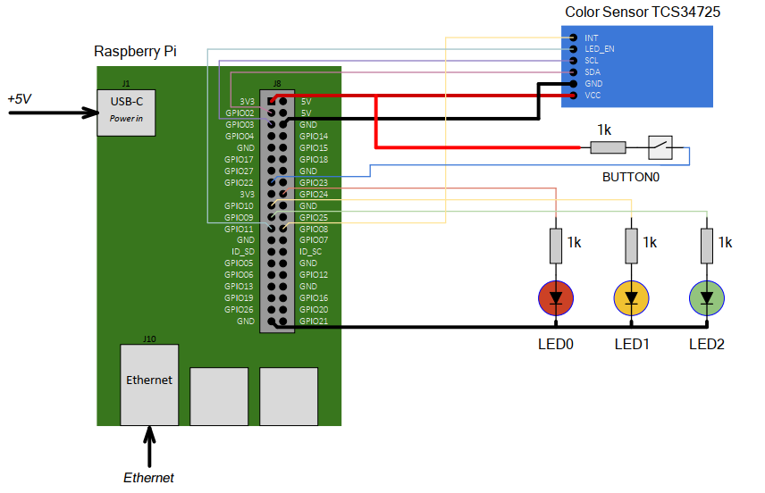

# Operating Systems | Traffic Light 

## Content

- [General view](#general-view)
- [Task description](#task-description)
- [Scheme](#scheme)
- [Job requirements](#job-requirements)
- [Current progress](#current-progress)
- [What I learned](#what-i-learned)
- [Software and hardware used](#software-and-hardware-used) -
[Author](#author)

## General view

### Task Description:
A prototype of an embedded system has been developed, namely a combination of software and a stand based on Raspberry Pi4, which allows you to control the switching of traffic lights according to a schedule (three LEDs), as well as to read the color using the corresponding sensor (Color Sensor TCS34725). The results of the recognized colors are displayed in the terminal of a personal computer connected to the embedded system via an ssh connection.

### Scheme
The scheme of the embedded system:

### Job Requirements
1. The embedded system must provide control of three LEDs in the traffic light mode and the determination of the color glow, the output of this information by executing three main programs: 1 – a program that controls the LEDs and polling the buttons of the debugging stand, 2 – a program that receives signals from the color sensor via the I2C interface, 3 – a program that receives data from programs 1 and 2 using one of the methods of interprocess communication (named and unnamed channels) and outputs the result of the operation of a traffic light and a certain color to the terminal of a personal computer connected to the embedded system via ssh connection.
2. The program-1 must ensure the interaction of RPi 4 with LEDs and buttons using GPIO, works in multithreaded mode and performs the following functions:
* setting the traffic light operation mode (switching times) by argument at start or through a command on unnamed channels;
* reading BUTTON0 button values to speed up switching;
* output of data on a glowing LED with a time stamp of the system;
* receiving commands to stop and start work on named channels;
3. The program-2 must ensure the interaction of RPi 4 with the color sensor via the I2C interface, works in multithreaded mode and performs the following functions:
* write and read values of color sensor registers;
* conversion of sensor data into a color value of three possible and their combination/absence of light;
* sending a signal about a color change or the absence of data with a timestamp of the system via named channels.
4. Program-3 must provide interaction with programs-1, -2, standard input/output stream, works in multithreaded mode, and also performs the following functions:
* exchange of messages via named/unnamed channels with applications-1,-2;
* messaging with a standard input/output stream, including receiving commands from the user (start, stop, change_color).
5. The embedded system must provide output of the results of work to the console in the following format:
* "measurement time" (hh:mm:ss)
* "traffic light operating mode - ... ",
* "measured color is ...", ("red", "green", "blue", "no light", "color combination").

## Current progress

### What I learned

### Software and hardware used

__Software__

__The list of equipment used:__
* Raspberry Pi 4 microcomputer;
* OS debugging board with connected: LEDs and buttons, color sensor (Color Sensor TCS34725);
* a personal computer with installed software (Putty, WinSCP, Git).

### Author
